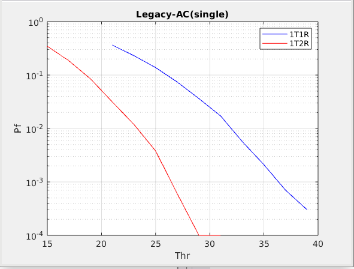
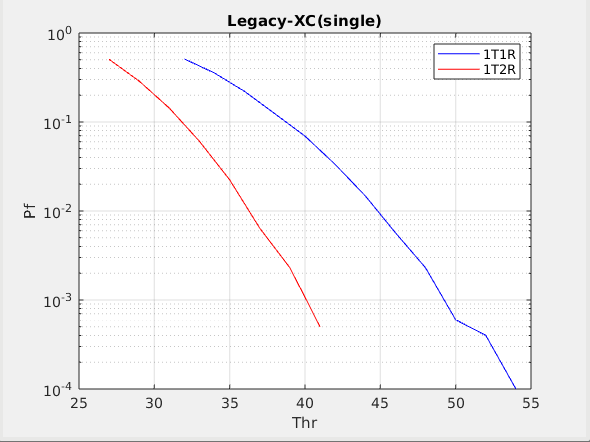
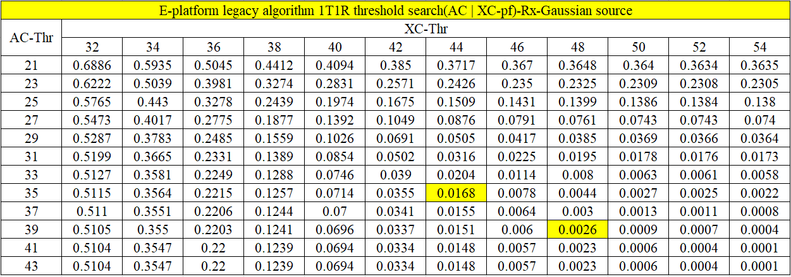
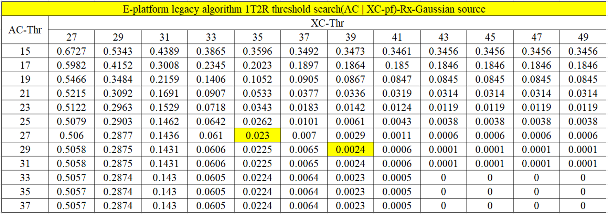

# 1. The redesign and legacy algorithm solution description  
Compare the different PD(Package Detection) algorithm solutions on E-platform prior of the CSFlag1, including algorithms & decision strategies.
## 1.1. 11a Algorithm / Strategy Description

**(a) Algorithm Description**
| Algo | Legacy | redesigned |
|-------------|-----------|----------------|
| AC-algo.1 | delay16-auto(delay sequence use sign bit,modulus) | delay16-auto(delay sequence use phase info,modulus) | 
| AC-algo.2 | Antennas Comb.(equal weight) | Antennas Comb.(antenna power weight) | 
| AC-algo.3 | ~ | freq. offset(phase) estiamtion from the input sequence | 
| AC-algo.4 | ~ | delay8-auto(delay sequence use phase info,modulus) | 
|-| | |
| XC-algo.1 | 1us length Cross-Corr(modulus) | 1us length Cross-Corr(modulus)) | 
| XC-algo.2 | Local sequence: non-constant modulus | Local sequence: constant modulus | 
| XC-algo.3 | Antennas Comb.(equal weight) | Antennas Comb.(antenna power weight) | 
| XC-algo.4 | ~ | freq. offset(accumulation phase) compensation to input sequence for cross-correlation | 
|-| | |
| power-algo.1 | Moving average antenna power calculation(modulus)  | Moving average antenna power calculation(modulus) | 
| power-algo.2 | Antennas Comb.(equal weight) | Antennas Comb.(antenna power weight) | 
| power-algo.3 | ~ | Antenna weight calculation ( LUT ) | 

**(b) Strategy Description**
| Dec | Legacy | redesigned |
|-------------|-----------|----------------|
| AC-dec=true| for n = n0   AC_D16(n) > $\rho_{AC16}$*P(n)  | for n = n0 and n0+16   AC_D16(n) > $\rho_{AC16}$ *P(n) and AC_D8(n) < $\rho_{AC8}$ *P(n) | 
|-| | |
| XC-dec=true | for n = n0   XC(n) > $\rho_{XC}$*P(n) | for n = n0 and n0+16   XC(n) > $\rho_{XC}$*P(n)| 
|-| | |
| Joint AC/XC-dec=true | AC-dec=true or XC-dec=true | AC-dec=true or XC-dec=true | 

## 1.2. 11b Algorithm / Strategy Description

**(a) Algorithm Description**
| Algo | Legacy | redesigned |
|-------------|-----------|----------------|
| XC-algo.1 | 1us length Cross-Corr(modulus square) | 2us length approximate Maximum Likelihood Cross-Corr(modulus) | 
| XC-algo.2 | ~(only 1 RX antenna used） | Antennas Comb.(antenna power weight) | 
| XC-algo.3 | Exponentially Weighted Moving Average(1 feedback IIR, delay22) | ~ | 
| XC-algo.4 | Sum of the Top 3 Maximum Values in Each Interval of Length 22 | ~ | 
|-| | |
| power-algo.1 | Instance antenna power calculation(modulus square,L=1)  | Moving average antenna power calculation(modulus,L=44) | 
| power-algo.2 | ~ | Antenna weight calculation ( LUT ) | 
| power-algo.3 | ~ | Antennas Comb.(antenna power weight) | 
| power-algo.4 | Smoothing(1 order TimeVariable IIR) | ~ | 

**(b) Strategy Description**
| Dec | Legacy | redesigned |
|-------------|-----------|----------------|
| XC-dec = true | for n = n0   XC(n) > $\rho_{XC}$*P(n) | for n = n0 and n0+22 and n0+44    XC(n) > $\rho_{XC}$*P(n)| 

# 2. 11a/b Simulation Platform Modification and Simulation Results  
Describes the modifications to the simulation Platform and the corresponding simulation results.  
## 2.1.  Simulation Environment Change
### 2.1.1.  Platform Modify  
**(1) Enable the AWGN source on the Rx-side for the $P_{f}$-performance verification**  
**(2) Add statistical variables to collect intermediate simulation results and obtain performance indicators**  
| Results Statistics | Location |
|-------------|-----------|
|CSFlag1   CSFlag2   CSFlag3   DsssDet | in AGCLoop.m |
|L-SIG Decoder |in OFDMHeaderDemod.m|
|mdmOn.ofdm   mdmOn.dsss |in ExeCase.m |

**(3) Modify the configuration to ensure the normal operation of the package detection process**  
| Parameter | Default Value | Modification Value | Location |
|-------------|-----------|----------------|----------------|
|SIM.PerfCrit|snr|pant|in tc_xxx.txt|
|CFG.RXALG|FLPT|FXPT|in defSTAs.txt|
|CFG.AGC|PFCT|FXPT|in defSTAs.txt|
|RF.RFName|NON|KARST|in defSTAs.txt|

### 2.1.2.  11a PD Modify
In order to continue the packet detection process even at low SNR (less than 1dB), the configuration needs to be modified as follows：
| Parameter | Default Value | Modification Value | Location |
|-------------|-----------|----------------|----------------|
|RIU.rampUpGap_qdB|16|6|in defSTAs.txt|

### 2.1.3.  11b PD Modify

## 2.2.  Simulation Results
### 2.2.1.  11a
### 2.2.1.1.  $P_{f}$  
**Legacy Algo**  

The independent simulation results of AC/XC are as follows:  
    
 
The Joint simulation results of AC/XC are as follows:
    
     
**Redesign Algo**

### 2.2.1.1.  $P_{m}$(AWGN)  
**Legacy Algo**  
The overall simulation results are shown below：
    
      
The line in the figure is explained as follows：  
| color | mean || linear | mean || marker | mean |
| - | - |-| - | - |-| - | - |
| red | XC || solid line | no CFO || no marker | 1T1R |
| blue | AC || dashed line | CFO=40ppm || circle | 1T2R |
| green | Joint || - | - || - | - |  

*Conclusion*  
(1) Under the same $P_{f}$ conditions, XC $P_{m}$ performs better than AC;  
(2) with CFO(40ppm), XC performance degradation of about 1dB, AC performance improvement of about 1dB(delay sequence use sign bit);  
(3) Joint:The performance of 1T2R is improved by about 3dB compared to 1T1R; with CFO(40ppm), The overall performance degradation is about 0.5dB;  

**Redesign Algo**

**compare**

### 2.2.2.  11b
