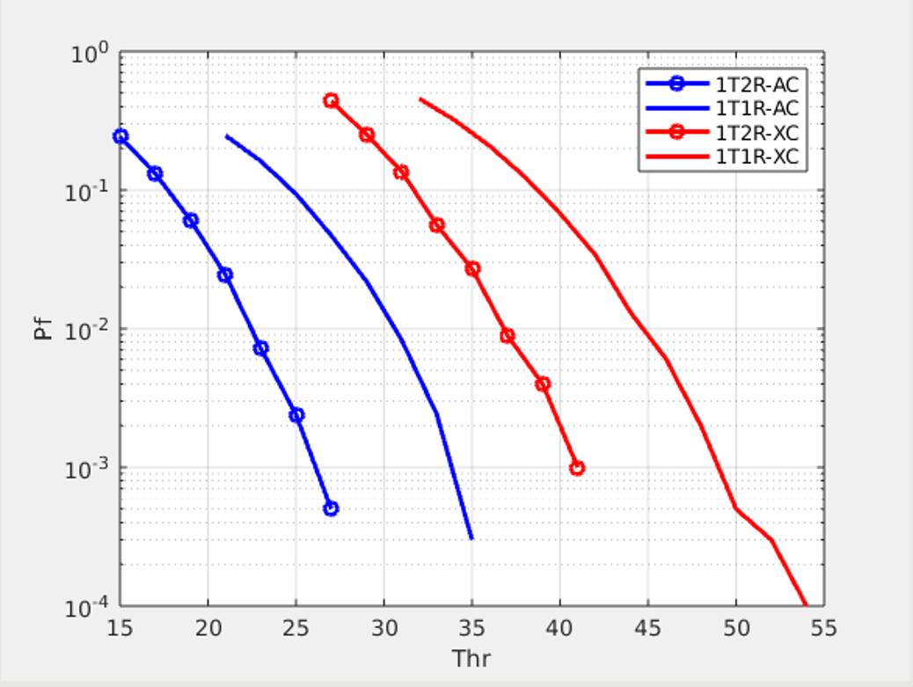
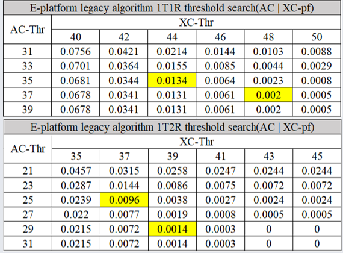
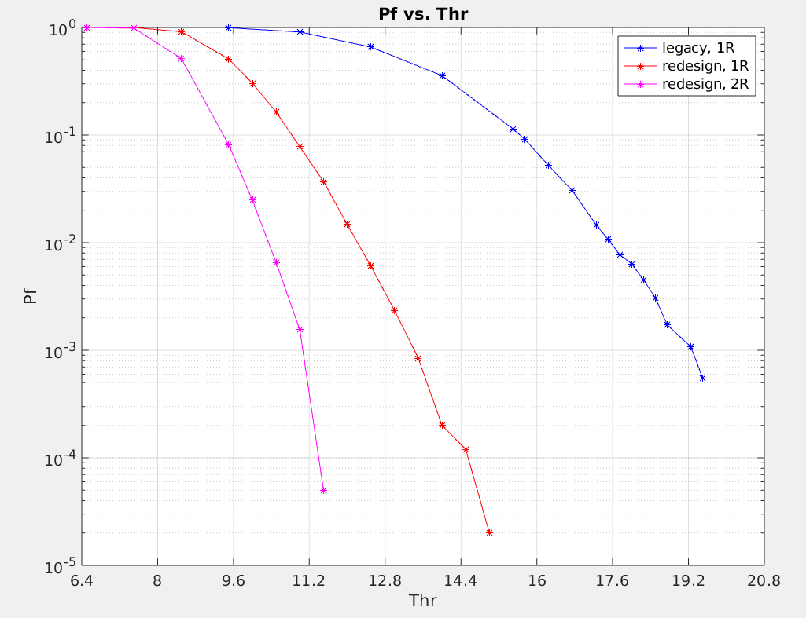

# 1. The redesign and legacy algorithm solution description  
Compare the different PD algorithm solutions on E-platform prior of the CSFlag1, including algorithms & decision strategies.  

modify test  
## 1.1. 802.11a Algorithm / Strategy Description

**(a) Algorithm Description**
| Algo | Legacy | redesigned |
|-------------|-----------|----------------|
| AC-algo.1 | delay16-auto(delay sequence use sign bit,modulus) | delay16-auto(delay sequence use phase info,modulus) | 
| AC-algo.2 | Antennas Comb.(equal weight) | Antennas Comb.(antenna power weight) | 
| AC-algo.3 | ~ | freq. offset(phase) estiamtion from the input sequence | 
| AC-algo.4 | ~ | delay8-auto(delay sequence use phase info,modulus) | 
|-| | |
| XC-algo.1 | 1us length Cross-Corr(modulus) | 1us length Cross-Corr(modulus)) | 
| XC-algo.2 | Local sequence: non-constant modulus | Local sequence: constant modulus | 
| XC-algo.3 | Antennas Comb.(equal weight) | Antennas Comb.(antenna power weight) | 
| XC-algo.4 | ~ | freq. offset(accumulation phase) compensation to input sequence for cross-correlation | 
|-| | |
| power-algo.1 | Moving average antenna power calculation(modulus)  | Moving average antenna power calculation(modulus) | 
| power-algo.2 | Antennas Comb.(equal weight) | Antennas Comb.(antenna power weight) | 
| power-algo.3 | ~ | Antenna weight calculation ( LUT ) | 

**(b) Strategy Description**
| Dec | Legacy | redesigned |
|-------------|-----------|----------------|
| AC-dec=true| for n = n0   AC_D16(n) > $\rho_{AC16}$*P(n)  | for n = n0 and n0+16   AC_D16(n) > $\rho_{AC16}$ *P(n) and AC_D8(n) < $\rho_{AC8}$ *P(n) | 
|-| | |
| XC-dec=true | for n = n0   XC(n) > $\rho_{XC}$*P(n) | for n = n0 and n0+16   XC(n) > $\rho_{XC}$*P(n)| 
|-| | |
| AC+XC-dec=true | AC-dec=true or XC-dec=true | AC-dec=true or XC-dec=true | 

## 1.2. 802.11b Algorithm / Strategy Description

**(a) Algorithm Description**
| Algo | Legacy | redesigned |
|-------------|-----------|----------------|
| XC-algo.1 | 1us length Cross-Corr(modulus square) | 2us length approximate Maximum Likelihood Cross-Corr(modulus) | 
| XC-algo.2 | ~(only 1 RX antenna used） | Antennas Comb.(antenna power weight) | 
| XC-algo.3 | Exponentially Weighted Moving Average(1 feedback IIR, delay22) | ~ | 
| XC-algo.4 | Sum of the Top 3 Maximum Values in Each Interval of Length 22 | ~ | 
|-| | |
| power-algo.1 | Instance antenna power calculation(modulus square,L=1)  | Moving average antenna power calculation(modulus,L=44) | 
| power-algo.2 | ~ | Antenna weight calculation ( LUT ) | 
| power-algo.3 | ~ | Antennas Comb.(antenna power weight) | 
| power-algo.4 | Smoothing(1 order TimeVariable IIR) | ~ | 

**(b) Strategy Description**
| Dec | Legacy | redesigned |
|-------------|-----------|----------------|
| XC-dec = true | for n = n0   XC(n) > $\rho_{XC}$*P(n) | for n = n0 and n0+22 and n0+44    XC(n) > $\rho_{XC}$*P(n)| 

# 2. 802.11a/b Simulation Platform Description
## 2.1.  Simulation Environment Change Description
(1) Enable the AWGN source on the Rx-side for the $P_{f}$-performance verification   
(2) Add statistical variables to collect intermediate simulation results and obtain performance indicators  
(3) Modify the configuration parameter to ensure the normal operation of the package detection process  

| Results Statistics | Location | | Parameter | Default Value | Modification Value | Location |
|-------------|-----------|-|-------------|-----------|----------------|----------------|
| CSFlag1-3 | in AGCLoop.m | |SIM.PerfCrit|snr|pant|in tc_xxx.txt|
| DsssDet | in AGCLoop.m | |CFG.RXALG|FLPT|FXPT|in defSTAs.txt|
|L-SIG Decoder |in OFDMHeaderDemod.m| |CFG.AGC|PFCT|FXPT|in defSTAs.txt|
|mdmOn.ofdm、mdmOn.dsss |in ExeCase.m | |RF.RFName|NON|KARST|in defSTAs.txt|

## 2.2.  802.11a PD Modify Description
To ensure that the 802.11a pd process can be executed even at low SNR ( < 1 dB), the configuration needs to be modified as follows：
| Parameter | Default Value | Modification Value | Location |
|-------------|-----------|----------------|----------------|
|RIU.rampUpGap_qdB|16|6|in defSTAs.txt|

## 2.3.  802.11b PD Modify Description
To ensure that the 802.11b packet detection process can be executed even at high SNR ( > 0 dB) and the detection period falls within the first X=10 us of the actual signal with FSM sample rate 80MHz , the configuration needs to be modified as follows：
| Parameter | Default Value | Modification Value | Location |
|-------------|-----------|----------------|----------------|
|idx|index of min([satTime,detTime disTime dsssTime])|4|in EventDecoder.m|
|timeRange|1661:2460|-(Newly added para.)|in EventDecoder.m|
|dsssFlagdebug|determined by status.dsssDet(timerange)|-(Newly added para.)|in EventDecoder.m|

# 3. 802.11a Simulation Results  
**Note:**    
(1) The simulation results are obtained under fixed **st(calculate st=1690, det st=1747)** conditions.  
(2) 'Pf-Thr' is unnormalized and should be normalized by 32 when simulating on E-platform. 
## 3.1. Legacy Algo
       
*Linear and colors: solid--no CFO；dash--CFO40ppm；red--XC-only，blue--AC-only，green--AC+XC.*   
**Conclusion:**   
(1) AC/XC-Only: XC better than AC(2dB); 2R better than 1R(2.5dB); XC w.o.CFO better than CFO40ppm(0.5dB);   
(2) AC+XC: 2R better than 1R(2.5dB); w.o.CFO better than CFO40ppm(0.5dB);  

## 3.2. Redesign Algo
       
*Linear and colors: solid--no CFO；dash--CFO40ppm；red--XC-only，blue--AC-only，green--AC+XC.*  
**Conclusion:**   
(1) AC/XC-Only: XC better than AC(about 1dB); 2R better than 1R(about 3dB); w.o.CFO and CFO40ppm perform similarly;   
(2) AC+XC: 2R better than 1R(about 3dB); w.o.CFO and CFO40ppm perform similarly; 

## 3.3. Legacy vs Redesign Algo

# 4.  802.11b Simulation Results
      
 *Linear and colors:  solid--no CFO; dash--CFO50ppm; blue--legacy algo. and 1R; red--redesign algo. and 1R; pink--redesign algo. and 2R.*    
 *Note:'Thr' is unnormalized and should be normalized by 32 when simulating on E-platform.*   
**Conclusion:**    
(1) The performance of both algorithms satisfies the requirements，i.e., SNR<-4dB@Pm=0.1% & Pf=0.1%.  
(2) redesign vs legacy (1T1R): redesign provides no gain over legacy, in fact it has negative gain (-2dB for Pf=0.1%).  
(3) 1R vs 2R (redesign): 2R provides about 3dB gain over 1R.  
(4) w.o.CFO vs CFO50ppm： CFO is somewhat significant on redesign algo., whereas it is very small on legacy algo.  

 
 
