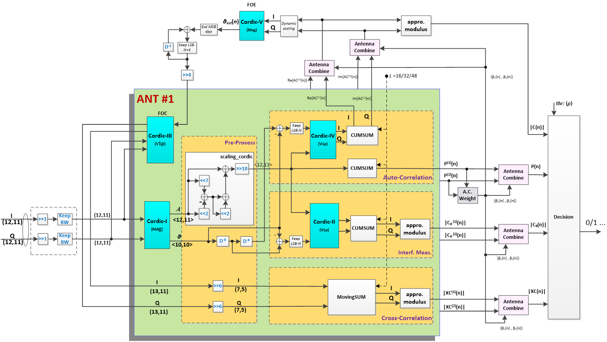
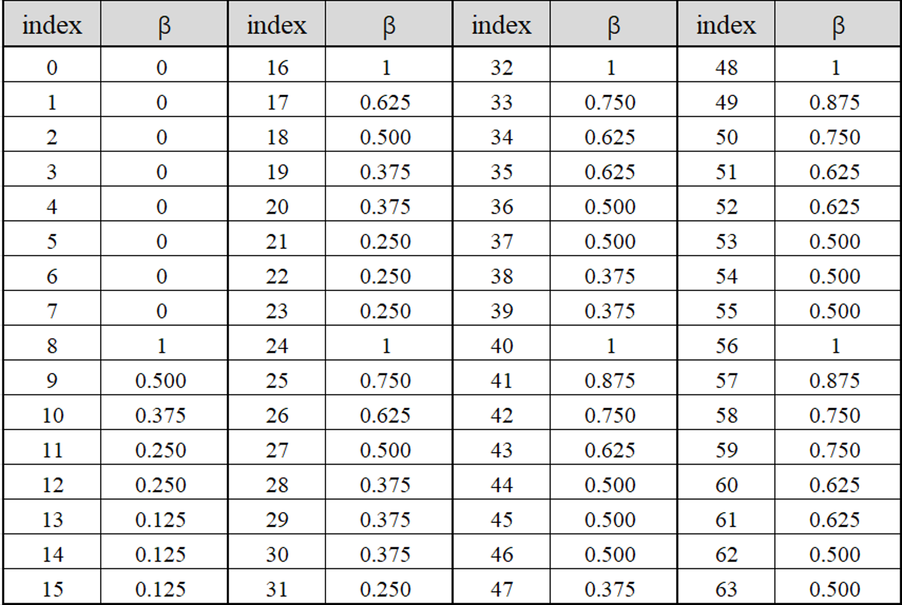
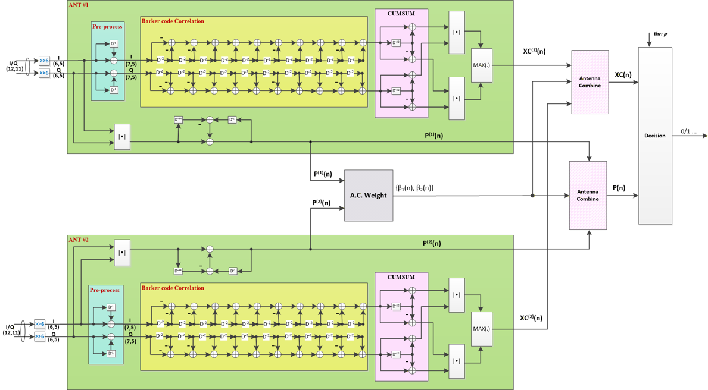

# Implementation 

## 1. 11a detection
### 1.1. modules and interface
#### 1.1.1. External modules

| Module name | Instances | Input bitwdith | Output bitwidth | Description |
|-------------|-----------|----------------|-----------------|-------------|
|cordic\_foe|1|12-bit I and Q|Angle, TBD (10 for now)|Frequency offset angle estimation|
|cordic\_foc|1 per antenna, 2 total|12-bit I and Q and 10-bit angle|13-bit I and Q|FOE derotation CORDIC. Scaled output with CORDIC factor|

#### 1.1.2. Internal modules

| Module name | Instances | Input bitwdith | Output bitwidth | Description |
|-------------|-----------|----------------|-----------------|-------------|
|cordic\_mag|2, 1 per antenna|12-bit I and Q|12-bit mag and 10-bit angle|Compute magnitude and angle for auto-correlation rotation|
| - |  |  |  |  |
|fixed\_scaling\_cordic|2, 1 per antenna|12 bit|12 bit|CORDIC output scaling down - divide by 1.6468|
|delay\_line\_8\_first|2, 1 per antenna|10 bits|10 bits|Delay line for auto-corr angle first 8 taps.|
|delay\_line\_8\_second|2, 1 per antenna|10 bits|10 bits|Delay line for auto-corr angle second 8 taps|
| - |  |  |  |  |
|cordic\_rot\_auto16|2, 1 per antenna|12-bit I and Q|13-bit I and Q|Perform auto-correlation for 16-tap delay line|
|running\_sum\_auto16|4, I and Q and 2 antennas|13 bits|19 bits|Running sum for auto-correlation. Max depth 64, covering 16, 32, 48.|
|antenna\_weighted\_combine|2, I and Q|19 bits ant1 and ant2|19 bits|Antenna weighted combine of auto-correlation sum 16. One for I, one for Q.|
|mod\_approx\_auto16|1|19-bit I and Q|19-bit mag out|Approximation computation for modulus|
|thresh\_auto16|1|19-bit weighted auto sum and weighted mag sum|1 bit|Threshold module for auto-correlation, 16 tap, above threshold.|
| - |  |  |  |  |
|cordic\_rot\_auto8|2, 1 per antenna|12-bit I and Q|13-bit I and Q|Perform auto-correlation for 8-tap delay line|
|running\_sum\_auto8|4, I and Q and 2 antennas|13 bits|19 bits|Running sum for auto-correlation. Max depth 64, covering 16, 32, 48.|
|mod\_approx\_auto8|2, 1 per antenna|19-bit I and Q|19-bit mag out|Approximation computation for modulus|
|antenna\_weighted\_combine|1|19 bits ant1 and ant2|19 bits|Antenna weighted combine of auto-correlation sum 8.|
|thresh\_auto8|1|19-bit weighted auto sum and weighted mag sum|1 bit|Threshold module for auto-correlation, 8 tap, below threshold.|
| - |  |  |  |  |
|**round\_13\_to\_7**|4, I and Q and 2 antennas|13 bits|7 bits|Input truncate/round to reduce computation complexity.|
|fixed\_param\_crosscorr|2, 1 per antenna|7-bit I and Q|13-bit I and Q|Fixed parameter cross correlation filter using adders and subtractors.|
|mod\_approx\_cross|2, 1 per antenna|13-bit I and Q|13-bit mag out|Approximation computation for modulus.|
|antenna\_weighted\_combine|1|13 bits ant1 and ant2|13 bits|Antenna weighted combine of cross-correlation sum.|
|thresh\_cross|1|13-bit weighted cross sum and weighted mag sum|1 bit|Threshold module for cross correlation, above threshold.|
| - |  |  |  |  |
|running\_sum\_mag|2, 1 per antenna|12 bits|18 bits|Running sum for power/magnitude. Max depth 64, covering 16, 32, 48.|
|weight\_comp\_lut|1|18-bit ant1 and ant2|3-bit ant1 and ant2|Compute weight for each antenna from mag sum|
|antenna\_weighted\_combine|1|18 bits ant1 and ant2|18 bits|Antenna weighted combine of mag sum.|
| - |  |  |  |  |
|**dynamic\_scaling\_19\_to\_12**|2, I and Q|19 bits|12 bits|Scaling from 19 bits to 12 bits to be used by cordic\_foe|

#### 1.1.3. Inputs and outputs

| Signal name | Input/Output | Bitwidth | Description |
|-------------|--------------|----------|-------------|
| x | Input | 12 bits | Signal I input |
| y | Input | 12 bits | Signal Q input |
| foe | Output | 10 bits | Estimated FOE vector |
| thresh_exceed_auto16 | Output | 1 bit | Autocorrelation output decision result |
| thresh_below_auto8 | Output | 1 bit | Autocorrelation output decision result |
| thresh_exceed_cross | Output | 1 bit | Cross correlation output decision result |

### 1.2. reference design
**top-level design diagram**
 

**lower-level design diagram**  
 
   

   
    

**Module Abbreviation Reference Table**  
| Module name | design diagram | | Module name | design diagram |
|-------------|--------------|-|--------------|-------------|
|cordic\_foe|FOE(Cordic-V)||cordic\_foc|FOC(Cordic-III)|
|cordic\_mag|Cordic-I||fixed\_scaling\_cordic|scaling\_cordic|
|delay\_line\_8\_first|(located in) Pre-Process||delay\_line\_8\_second|(located in) Pre-Process|
|cordic\_rot\_auto16|Cordic-IV||running\_sum\_auto16|CUMSUM in Auto-Correlation|
|antenna\_weighted\_combine|Antenna Combine||mod\_approx\_auto16|appro.modulus|
|thresh\_auto16|Decision||cordic\_rot\_auto8|Cordic-II|
|running\_sum\_auto8|CUMSUM in Interf.Meas||mod\_approx\_auto8|appro.Modulus in Interf.Meas|
|antenna\_weighted\_combine|Antenna Combine||thresh\_auto8|Decision|
|round\_13\_to\_7|(located in) Pre-Process||fixed\_param\_crosscorr|MovingSUM|
|mod\_approx\_cross|appro.Modulus in Cross-Correlation||antenna\_weighted\_combine|Antenna Combine|
|thresh\_cross|Decision||running\_sum\_mag|CUMSUM in Auto-Correlation|
|weight\_comp\_lut* |A.C.Weight||antenna\_weighted\_combine|Antenna Combine|
|dynamic\_scaling\_19\_to\_12|Dynamic scaling||||

The LUT in the weight_comp_lut module is shown below (used for both 11a/b)  
 

## 2. 11b detection
### 2.1. modules and interface
#### 2.1.1. External modules

#### 2.1.2. Internal modules

| Module name | Instances | Input bitwdith | Output bitwidth | Description |
|-------------|-----------|----------------|-----------------|-------------|
|round\_12\_to\_6|4, I and Q and 2 antennas|12 bits|6 bits|Input truncate/round to reduce computation complexity|
|delay\_add\_1tap|4, I and Q and 2 antennas|6 bits|7 bits|input add the delayed-1 input|
|fixed\_param\_crosscorr|2, 1 per antenna|7-bit I and Q|11-bit I and Q|Fixed parameter cross correlation filter using adders and subtractors|
|delay\_add\_22tap|4, I and Q and 2 antennas|11-bit I and Q|12-bit I and Q|combine the same consecutive 2 preamble bits and sum them up|
|delay\_sub\_22tap|4, I and Q and 2 antennas|11-bit I and Q|12-bit I and Q|combine the different consecutive 2 preamble bits and sum them up|
|delay\_line\_22|4, I and Q and 2 antennas|11 bits|11 bits|delay line for sum up the cross-correlation in "delay\_add\_22tap" \& "delay\_sub\_22tap" modules|
|mod\_approx\_crosscorr|4, 2 possible preamble-bits combinations and 2 antennas|12-bit I and Q|12-bit mag out|Approximation computation modulus|
|max\_select|2, 1 per antenna|12-bit|12-bit|Select the data with the maximum modulus value|
|antenna\_weighted\_combine|1|12 bits ant1 and ant2|12 bits|Antenna weighted combine of cross-correlation sum|
|thresh\_cross|1|12-bit weighted cross sum and weighted mag sum|1 bit|Threshold module for cross correlation, above threshold|
|-|||||
|mod\_approx\_pwr|2, 1 per antenna|6-bit I and Q|6-bit mag out|Approximation computation modulus for every truncted-input|
|runing\_sum\_mag|2, 1 per antenna|6-bit mag|12-bit mag out|Running sum for magnitude|
|weight\_comp\_lut|1|12-bit ant1 and ant2|3-bit ant1 and ant2|Compute weight for each antenna from mag sum|
|antenna\_weighted\_combine|1|12 bits ant1 and ant2|12 bits|Antenna weighted combine of mag sum|

#### 2.1.3. Inputs and outputs

| Signal name | Input/Output | Bitwidth | Description |
|-------------|--------------|----------|-------------|
| x | Input | 12 bits | Signal I input |
| y | Input | 12 bits | Signal Q input |
| thresh_exceed_cross | Output | 1 bit | Cross correlation output decision result |

### 2.2. reference design
**top-level design diagram** 
 
 
**lower-level design diagram**  
 
  
   

**Notes**  
* 1、A.C.Weight and Antenna Combine refer to section 11a above.

**Module Abbreviation Reference Table**  
| Module name | design diagram | | Module name | design diagram |
|-------------|--------------|-|--------------|-------------|
|round\_12\_to\_6|in top-level||delay\_add\_1tap|Pre-process|
|fixed\_param\_crosscorr|Barker code Correlation||delay\_add\_22tap|(located in) CUMSUM|
|delay\_sub\_22tap|(located in) CUMSUM||delay\_line\_22|(located in) CUMSUM|
|mod\_approx\_crosscorr|appro. modulus||max\_select|MAX|
|antenna\_weighted\_combine|Antenna Combine||thresh\_cross|Decision|
|mod\_approx\_pwr|appro. modulus||runing\_sum\_mag|in top-level|
|weight\_comp\_lut* |A.C.Weight||antenna\_weighted\_combine|Antenna Combine|
